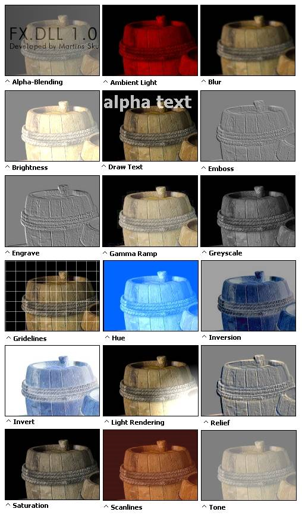



## FX\.DLL 1\.03 SDK

### Description

The version 1.03 is here! A total of 46 graphical routines, excellent speed and easy to use. All this and many, many more in this SDK. Also all 5000 lines of source-code now included for the taking. Check out the screen-shot! Don't wait, experience it!
 
### More Info
 

             |
---                |---
**Submitted On**   |2003-06-03 09:58:06
**By**             |[Martins Skujenieks](https://github.com/Planet-Source-Code/PSCIndex/blob/master/ByAuthor/martins-skujenieks.md)
**Level**          |Advanced
**User Rating**    |4.9 (370 globes from 75 users)
**Compatibility**  |VB 4\.0 \(32\-bit\), VB 5\.0, VB 6\.0, VB Script, VBA MS Access, VBA MS Excel
**Category**       |[Libraries](https://github.com/Planet-Source-Code/PSCIndex/blob/master/ByCategory/libraries__1-49.md)
**World**          |[Visual Basic](https://github.com/Planet-Source-Code/PSCIndex/blob/master/ByWorld/visual-basic.md)
**Archive File**   |[FX\_DLL\_1\_0159616632003\.zip](https://github.com/Planet-Source-Code/martins-skujenieks-fx-dll-1-03-sdk__1-45929/archive/master.zip)

